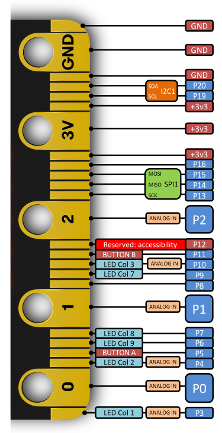

# Conector de borde
Hay 25 pistas/patillas que incluyen 5 anillos para usar con clavijas tipo banana de 4 mm o pinzas de cocodrilo. 3 de estos anillos son para entrada y salida de propósito general (GPIO) y también sirven para detección analógica, PWM y táctil, y dos están conectados a la alimentación de la micro:bit.

Las pistas mas finas están separadas 1,27 mm, algunas son utilizadas por micro:bit  y otras están disponibles para su uso mediante cualquiera de los conectores externos existentes.

Solamente tienen conexión las pistas frontales, las posteriores están sin conexión y los anillos posteriores están conectados a los delanteros.

## Diagrama de pines del conector de borde
En la imagen 1a tenemos la descripción de pines de la micro:bit v2 y en la imagen 1b el de la v1 para poder comparar y establecer las diferencias de una forma sencilla.

| Imagen 1a | Imagen 1b |
|:-:|:-:|
|  |  |
| Pinout microbit v2 | Pinout microbit v1 |

En [microbit.pinout.xyz](https://microbit.pinout.xyz/) tenemos un fantástico recurso para obtener más información sobre los pines de la micro:bit y de cómo los utilizan algunos accesorios.

En en enlace tenemos una [guia de accesorios para micro:bit](https://cdn.sanity.io/files/ajwvhvgo/production/c6f0a76cbe149f91fb998fba3f76e4816187e575.pdf?dl=AccessoryGuide.pdf)
